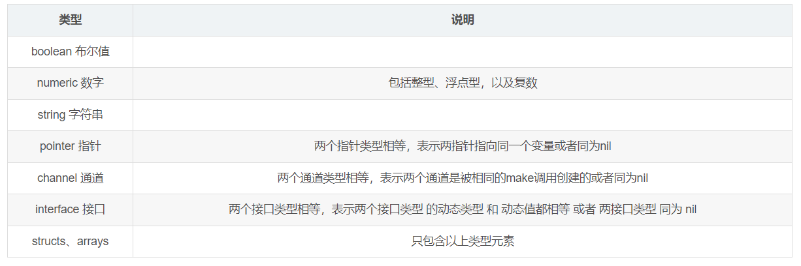
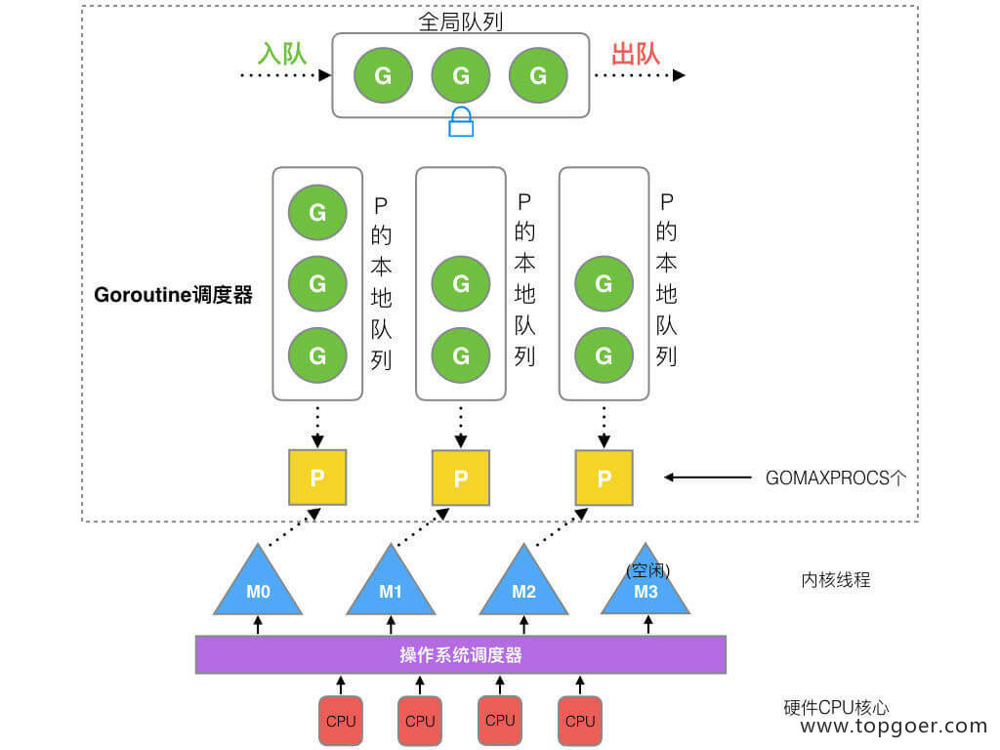

# 基础篇

### 01 = 和：=

= 是赋值变量
：=是定义变量
使用 := 需在 **方法内** 定义，方法外定义变量需要声明 **var**

### 02指针
*int a
a是一个指针
int b =2
&b  &取地址符  *是取值符  但在定义时 *是表示指针

### Go的异常处理

#### 错误
 错误是程序中可能出现的问题，比如连接数据库失败，连接网络失败等，在程序设计中，错误处理是业务的一部分。

#### 异常
异常则是意料之外的，甚至你认为在编码中不可能发生的，Go 遇到异常会自动触发 panic（恐慌），触发 panic 程序会自动退出。除了程序自动触发异常，一些你认为不可允许的情况你也可以手动触发异常

### error类
在Go语言中，异常被定义为实现了 *error* 接口的类型。
error接口只包含一个方法  *Error()* ，用于返回错误信息。异常可以是任何实现了error接口的类型。

以下是一个异常的定义示例：


```
type MyException struct {
    Message string
}

func (e *MyException) Error() string {
    return e.Message
}

```
自己定义的异常类，只要实现了 Error()方法 就是异常类
这个方法会在异常被捕获时被调用。


假如方法有一些预料到的问题，就是错误，应该自己定义错误并返回错误信息


#### error处理的原则

**error只应该被处理一次，打印error也是对error的一种处理。所以对于error，要么打印出来，要么就把error返回传递给上一层。**

# go基础

## 1.数组和切片

#### 相同点：

1)只能存储一组相同类型的数据结构

2)都是通过下标来访问，并且有容量长度，长度通过 len 获取，容量通过 cap 获取

#### 区别：

1）数组是定长，访问和复制不能超过数组定义的长度，否则就会下标越界，**切片长度和容量可以自动扩容**

2）**数组是值类型**，**切片是引用类型**，每个切片都引用了一个底层数组，切片本身不能存储任何数据，都是这底层数组存储数据，所以修改切片的时候修改的是底层数组中的数据。切片一旦扩容，指向一个新的底层数组，内存地址也就随之改变


简洁的回答：
1）定义方式不一样 2）初始化方式不一样，数组需要指定大小，大小不改变 3）在函数传递中，数组切片都是值传递。

#### 定义
```
数组
var a1 [3]int
var a2 [...]int{1,2,3}

切片
var a1 []int
var a2 :=make([]int,3,5)
```
切片本质上由三个东西构成

**1.指向底层数组的指针**
**2.长度**
**3.容量**
上面的make就对应了这两个部分

### Go 的 slice 底层数据结构和一些特性？
Go 的 slice 底层数据结构是由一个 array 指针指向的底层数组，len 表示切片长度，cap 表示切片容量。slice 的主要实现是扩容。对于 append 向 slice 添加元素时，假如 slice 容量够用，则追加新元素进去，slice.len++，返回原来的 slice。当原容量不够，则 slice 先扩容，扩容之后 slice 得到新的 slice，将元素追加进新的 slice，slice.len++，返回新的 slice。对于切片的扩容规则：当切片比较小时（容量小于 1024），则采用较大的扩容倍速进行扩容（新的扩容会是原来的 2 倍），避免频繁扩容，从而减少内存分配的次数和数据拷贝的代价。当切片较大的时（原来的 slice 的容量大于或者等于 1024），采用较小的扩容倍速（新的扩容将扩大大于或者等于原来 1.25 倍），主要避免空间浪费，网上其实很多总结的是 1.25 倍，那是在不考虑内存对齐的情况下，实际上还要考虑内存对齐，扩容是大于或者等于 1.25 倍。

（关于刚才问的 slice 为什么传到函数内可能被修改，如果 slice 在函数内没有出现扩容，函数外和函数内 slice 变量指向是同一个数组，则函数内复制的 slice 变量值出现更改，函数外这个 slice 变量值也会被修改。如果 slice 在函数内出现扩容，则函数内变量的值会新生成一个数组（也就是新的 slice，而函数外的 slice 指向的还是原来的 slice，则函数内的修改不会影响函数外的 slice。）


## 2.make 和 new 的区别

#### 相同点

给变量分配内存

#### 不同点

1）作用变量类型不同，new给**string,int和数组**分配内存，make给**切片，map，channel**分配内存（专门为这几个类型分配，因为new不能分配他们）；

2）返回类型不一样，new返回指向变量的指针，make返回变量本身（本身就是指针）；

3）new 分配的空间被清零。make 分配空间后，会进行初始化；

## 3.for range

go一般用for a,b ：=  range c  来遍历一个**数组**或者是**切片**。相当于是python中的enumerate，但是go中两个值一定要写，不写的话，要这样  for _,b := range c

for range 中a 和 b 在内存中只会存在一份，即之后每次循环时遍历到的数据都是以值覆盖的方式赋给 a 和 b，a，b 的内存地址始终不变。

由于有这个特性，for 循环里面如果开协程，不要直接把 a 或者 b 的地址传给协程！！。

解决办法：在每次循环时，创建一个临时变量。


## 4.go defer

defer是Go语言中的一个关键字（延迟调用），一般用于释放资源和连接、关闭文件、释放锁等。和defer类似的有java的finally和C++的析构函数，这些语句一般是一定会执行的。不过析构函数析构的是对象，而defer后面一般跟函数或方法
defer在函数结束后一定会调用，不管是正常结束还是异常结束


```
package main

import "fmt"

func main() {
    var whatever [5]struct{}
    for i := range whatever {
        defer fmt.Println(i)
    }
}

```
输出
```
    4
    3
    2
    1
    0
```

相当于defer后面的语句会进栈

**defer声明时，对应的参数会实时解析**
当输入有参函数和无参函数、方法后，输出的值不同哦

```
package main

import "fmt"

func test(a int) {//无返回值函数
	defer fmt.Println("1、a =", a) //方法
	defer func(v int) { fmt.Println("2、a =", v)} (a) //有参函数
	defer func() { fmt.Println("3、a =", a)} () //无参函数
	a++
}
func main() {
	test(1)
}


```
输出

```
3、a = 2
2、a = 1
1、a = 1

```

**defer可读取函数返回值**

defer、return、返回值三者的执行逻辑应该是：
return最先执行，return负责将结果写入返回值中；
接着defer开始执行一些收尾工作；
最后函数携带当前返回值（可能和最初的返回值不相同）退出。

*即我可以在defer里修改返回值（前提方法指定了返回值）*

```
package main

import "fmt"

func f(i int) int{
	return i
	defer fmt.Print("i =", i)
	return i+1
}

func main() {
	f(1)
}
```
错误示例，函数直接结束了都不会运行你的defer

**defer最常用的  '关闭文件'和 '互斥锁'**

```
func ReadFile(filename string) ([]byte, error) {
    f, err := os.Open(filename)
    if err != nil {
        return nil, err
    }
    defer f.close()
    return ReadAll()
}

```
结束自动关闭文件
```
var mu sync.Mutex
var m = make(map[string]int)
 
func lookup(key string) int {
    mu.Lock()
    defer mu.Unlock()
    return m[key]
}

```
结束自动开锁


## 5.单引号、双引号、反引号的区别

单引号，**表示byte类型或rune类型**，对应 uint8和int32类型，默认是 rune 类型。byte用来强调数据是raw data，而不是数字；而rune用来表示Unicode的code point。


双引号，才是**字符串**，实际上是字符数组。可以用索引号访问某字节，也可以用len()函数来获取字符串所占的字节长度。


反引号，表示**字符串字面量，不支持任何转义序列**。字面量 raw literal string 的意思是，你定义时写的啥样，它就啥样，你有换行，它就换行。你写转义字符，它也就展示转义字符。


## 6. go uint类型

uint是无符号整型  
int则是带符号的整型

当uint类型溢出时，不会报错但是数值会变的很奇怪

```
var a uint8 = 1
var b uint8 = 255
fmt.Println("减法：", a-b)
fmt.Println("加法：", a+b)
fmt.Println("乘法：", a*b)
	// 结果为：
	// 减法： 2
	// 加法： 0
	// 乘法： 255


```

## 7. go rune

#### rune是啥？
rune类型是 Go 语言的一种特殊数字类型。在builtin/builtin.go文件中，它的定义：type rune = int32；官方对它的解释是：**rune是类型int32的别名，在所有方面都等价于它**，用来区分字符值跟整数值。使用单引号定义 ，返回采用 UTF-8 编码的 Unicode 码点。

Go 语言通过rune处理中文，支持国际化多语言。

同样的还有byte类型，相当于uint8 .**rune和byte专门用来处理字符。**

在 Go 语言中，字符可以被分成两种类型处理：对占 1 个字节的英文类字符，可以使用byte（或者unit8）；对占 1 ~ 4 个字节的其他字符，可以使用rune（或者int32），如中文、特殊符号等。

在go中一个英文字符占一个字节，一个中文字符占3个字节

```
/ 使用内置函数 len() 统计字符串长度
fmt.Println(len("Go语言编程"))  // 输出：14
```

```
// 转换成 rune 数组后统计字符串长度
fmt.Println(len([]rune("Go语言编程")))  // 输出：6
```
rune类型的第一个功能，即统计字符串长度。
```
s := "Go语言编程"
fmt.Println(s[0:7]) // 输出：Go语�
```
按照字节的方式进行截取，必须预先计算出需要截取字符串的字节数，如果字节数计算错误，就会显示乱码

```
s := "Go语言编程"
// 转成 rune 数组，需要几个字符，取几个字符
fmt.Println(string([]rune(s)[:4])) // 输出：Go语言

```
rune类型的第二个功能，即截取字符串。


## 8. go string类型

字符串就是一串固定长度的 字符 链接起来的 字符序列，go的字符串是由单个字节连接起来的，go语言的字符串的字节使用utf-8编码标识unicode文本

### string和[]byte 的区别

string底层本质就是一个byte类型的数组，那么问题就来了，string类型为什么还要在数组的基础上再进行一次封装呢？


因为在Go语言中string类型被设计为**不可变的**，不仅是在Go语言，其他语言中string类型也是被设计为不可变的，这样的好处就是：**在并发场景下，我们可以在不加锁的控制下，多次使用同一字符串，在保证高效共享的情况下而不用担心安全问题。**


[]byte和string是可以转换的

## 9. go map 

### map 的数据结构是什么？是怎么实现扩容？

数据结构为**hash数组** + **桶** + **溢出的桶链表**，每个桶存储最多8个key-value对

链式哈希表从根本上说是由**一组链表**构成。**每个链表**都可以看做**是一个“桶”**，我们将所有的元素通过散列的方式放到具体的不同的桶中。插入元素时，首先将其键传入一个哈希函数（该过程称为哈希键），函数通过散列的方式告知元素属于哪个“桶”，然后在相应的链表头插入元素

扩容通过***装载因子**扩容，装载因子的计算公式是：**装载因子=填入表中的元素个数/散列表的长度**，装载因子越大，说明空闲位置越少，冲突越多，散列表的性能会下降。

装载因子一般6.5


### go 哪些类型可以作为map key

在golang规范中，**可比较的类型**都可以作为map key

那么哪些类型可以比较？


所以下面的类型是不能作为  map key的
- slices
- maps
- functions

### map 使用注意的点，是否并发安全

map的类型是map[key]，key类型的key必须是可比较的，通常情况，会选择内建的基本类型，比如整数、字符串做key的类型。如果要使用struct作为key，要**保证struct对象在逻辑上是不可变的**。在Go语言中，map[key]函数返回结果可以是一个值，也可以是两个值。map是无序的，如果我们想要保证遍历map时元素有序，可以使用辅助的数据结构，例如orderedmap。

- 第一，一定要先初始化，否则panic
 
- 第二，map类型是容易发生并发访问问题的。不注意就容易发生程序运行时并发读写导致的panic。 Go语言内建的map对象不是线程安全的，并发读写的时候运行时会有检查，遇到并发问题就会导致panic。


### map 循环是有序的还是无序的？

无序的, map 因扩张⽽重新哈希时，各键值项存储位置都可能会发生改变，顺序自然也没法保证了，所以官方避免大家依赖顺序，直接打乱处理。就是 for range map 在开始处理循环逻辑的时候，就做了随机播种


### map 中删除一个 key，它的内存会释放么？
如果删除的元素是值类型，如**int，float，bool，string以及数组和struct**，map的内存不会自动释放。  （大部分就是这种）

如果删除的元素是引用类型，如**指针，slice，map，chan**等，map的内存会自动释放，但释放的内存是子元素引用类型的内存占用

**将map设置为nil后，内存被回收**。用nil回收内存

### 因为map是并发不安全的，那么怎么处理对 map 进行的并发访问

- 使用内置sync.Map
- 使用读写锁实现并发安全map
  
```
type SafeMap struct {
    sync.RWMutex
    Map map[string]string
}


func (sm *SafeMap) ReadMap(key string) string {
    sm.RLock()
    value := sm.Map[key]
    sm.RUnlock()
    return value
}

func (sm *SafeMap) WriteMap(key string, value string) {
    sm.Lock()
    sm.Map[key] = value
    sm.Unlock()
}

```
读和写的时候对map加锁

但相对来说，锁会大大降低程序的性能，那如何优化呢？其中一个优化思路就是降低锁的粒度，不对整个 map 进行加锁。

这种方法是**分片加锁**，将这个 map 分成 n 块，每个块之间的读写操作都互不干扰，从而降低冲突的可能性。

```
const N = 16

type SafeMap struct {
    maps  [N]map[string]string
    locks [N]sync.RWMutex
}

func NewSafeMap() *SafeMap {
    sm := new(SafeMap)
    for i := 0; i < N; i++ {
        sm.maps[i] = make(map[string]string)
    }
    return sm
}

func (sm *SafeMap) ReadMap(key string) string {
    index := hash(key) % N
    sm.locks[index].RLock()
    value := sm.maps[index][key]
    sm.locks[index].RUnlock()
    return value
}

func (sm *SafeMap) WriteMap(key string, value string) {
    index := hash(key) % N
    sm.locks[index].Lock()
    sm.maps[index][key] = value
    sm.locks[index].Unlock()
}

func hash(s string) int {
    h := 0
    for i := 0; i < len(s); i++ {
        h = 31*h + int(s[i])
    }
    return h
}

```

GO 1.9 提供了并发安全的map,通过将读写分离的方式实现了某些特定场景下的性能提升

```
var m sync.Map
```

### nil map 和空 map 有何不同？

**nil map 未初始化，空map是长度为空**

- 可以对未初始化的map进行取值，但取出来的东西是空
- 不能对未初始化的map进行赋值，这样将会抛出一个异常
- 通过fmt打印map时，空map和nil map结果是一样的，都为map[]。所以，这个时候别断定map是空还是nil，而应该通过map == nil来判断。


# Go 进阶一点点

## go tag

正常情况下，你定义的结构体是这样子的，每个字段都由名字和字段类型组成

```
type Person struct {
    Name string 
    Age  int   
    Addr string
}
```

也有例外，就像下面这样子，字段上还可以额外再加一个属性，用反引号（Esc键下面的那个键）包含的字符串，称之为 Tag，也就是标签。

```
type Person struct {
    Name string `json:"name"`
    Age  int    `json:"age"`
    Addr string `json:"addr,omitempty"`
}
```


```
package main

import (
    "encoding/json"
    "fmt"
)

type Person struct {
    Name string `json:"name"`
    Age  int    `json:"age"`
    Addr string `json:"addr,omitempty"`
}

func main() {
    p1 := Person{
        Name: "Jack",
        Age:  22,
    }

    data1, err := json.Marshal(p1)
    if err != nil {
        panic(err)
    }

    // p1 没有 Addr，就不会打印了
    fmt.Printf("%s\n", data1)

    // ================

    p2 := Person{
        Name: "Jack",
        Age:  22,
        Addr: "China",
    }

    data2, err := json.Marshal(p2)
    if err != nil {
        panic(err)
    }

    // p2 则会打印所有
    fmt.Printf("%s\n", data2)
}
```

由于 Person 结构体里的 Addr 字段有 omitempty 属性，因此 encoding/json 在将对象转化 json 字符串时，只要发现对象里的 Addr 为 false， 0， 空指针，空接口，空数组，空切片，空映射，空字符串中的一种，就会被忽略。


Go语言提供了**可通过反射发现的的结构体标签**，这些在标准库json/xml中得到了广泛的使用，orm框架也支持了结构体标签

**tag 标签的语法规则：**
结构体标签（tag）可以有**多个键值对**，**键与值要用冒号分隔**，**值要使用双引号括起来**，**多个键值对之间要使用一个空格分隔**

json、yaml、gorm、validate、mapstructure、protobuf这几个库的结构体标签是很常用的

结构体标签（tag）是可以随意写的，只要符合语法规则，任意写都可以的，但是一些库没有支持该标签的情况下，随意写的标签是没有任何意义的，如果想要我们的标签变得有意义，就需要我们提供解析方法。可以通过反射的方式获取标签

```
type User struct {
 Name string `tag:"Username"`
 Age  uint16 `tag:"age"`
 Password string `tag:"min=6,max=10"`
}
func getTag(u User) {
 t := reflect.TypeOf(u)

 for i := 0; i < t.NumField(); i++ {
  field := t.Field(i)
  tag := field.Tag.Get("tag")
  fmt.Println("get tag is ", tag)
 }
}

func main()  {
 u := User{
  Name: "tytyty",
  Age: 5,
  Password: "123456",
 }
 getTag(u)
}

```

## go 反射

前面已经看到Go 中解析的 tag 是通过**反射**实现的。

- 那么什么是反射
**反射就是在程序运行时期对程序本身进行访问和修改的能力**

- 为什么用反射
  根据反射的能力，自然是因为我们**提供的接口并不知道传入的数据类型会是什么样的**， 只有**当程序运行的时候才知道具体的数据类型**但是我们编码的时候又期望去校验程序运行时传入的类型会是什么样的（例如 json 的序列化）并对其这种具体的数据进行操作，这个时候，咱们就需要用到反射的能力了

1.Golang提供了一个reflect.Type接口，通过调用reflect.TypeOf函数可以获取一个对象的类型

2.在Golang中，我们可以使用reflect.Value来表示一个反射值。通过调用reflect.ValueOf函数可以将一个普通的对象转换为反射值。然后，我们可以使用反射值的FieldByName方法来获取对象的字段值，使用FieldByNameFunc方法来按照条件获取字段值，以及使用Set方法来设置字段值

3.除了获取和设置对象的属性值，反射还可以用于动态调用对象的方法。在Golang中，我们可以使用reflect.Value的MethodByName方法来获取对象的方法，然后使用Call方法来调用该方法

## 调用函数传入结构体时，应该传值还是指针？ 

**Go 的函数参数传递都是值传递。** 所谓值传递：指在**调用函数时将实际参数复制一份传递到函数中**，这样**在函数中如果对参数进行修改，将不会影响到实际参数**。所以你设计一个函数希望这个函数可以影响外部的对象或是参数时，传入的应该是这个对象的引用。

需要注意的是，Go 里面的 map，slice，chan 是引用类型。变量区分值类型和引用类型。所谓值类型：变量和变量的值存在同一个位置。所谓引用类型：变量和变量的值是不同的位置，变量的值存储的是对值的引用。但并不是 map，slice，chan 的所有的变量在函数内都能被修改，不同数据类型的底层存储结构和实现可能不太一样，情况也就不一样。

##  Go 的 select 底层数据结构和一些特性

Go 的 select 为 golang 提供了多路 IO 复用机制，和其他 IO 复用一样，**用于检测是否有读写事件是否 ready。** linux 的系统 IO 模型有 select，poll，epoll，go 的 select 和 linux 系统 select 非常相似。
 
select 结构组成主要是由 case 语句和执行的函数组成
select 实现的多路复用是：每个线程或者进程都先到注册和接受的 channel（装置）注册，然后阻塞，然后只有一个线程在运输，当注册的线程和进程准备好数据后，装置会根据注册的信息得到相应的数据。

select 的特性

1）select 操作至少要有一个 case 语句，出现读写 nil 的 channel 该分支会忽略，在 nil 的 channel 上操作则会报错。

2）select 仅支持管道，而且是单协程操作。

3）每个 case 语句仅能处理一个管道，要么读要么写。

4）多个 case 语句的执行顺序是随机的。

5）存在 default 语句，select 将不会阻塞，但是存在 default 会影响性能。

## go context

Context通常被称为上下文，在go中，理解为goroutine的运行状态、现场。
实现当中存在上下层goroutine context的传递，上层goroutine会把context传递给下层goroutine。

每个goroutine在运行前，都要事先知道程序当前的执行状态，通常将这些状态封装在一个 context变量，传递给要执行的goroutine中。

在网络编程中，当接收到一个网络请求的request，处理request时，可能会在多个goroutine中处理。而这些goroutine可能需要共享Request的一些信息；当request被取消或者超时时，所有从这个request创建的goroutine也要被结束。

go context包不仅实现了在程序单元之间共享状态变量的方法，同时能通过简单的方法，在被调用程序单元外部，通过设置ctx变量的值，将过期或撤销等信号传递给被调用的程序单元。在网络编程中，如果存在A调用B的API，B调用C的 API，如果A调用B取消，那么B调用C也应该被取消，通过在A、B、C调用之间传递context，以及判断其状态，就能解决此问题。

通过context包，可以非常方便地在请求goroutine之间传递请求数据、取消信号和超时信息。


1. context包通过构建树形关系的context，来达到上一层goroutine对下一层goroutine的控制。对于处理一个request请求操作，需要通过goroutine来层层控制goroutine，以及传递一些变量来共享。

2. context变量的请求周期一般为一个请求的处理周期。即针对一个请求创建context对象；在请求处理结束后，撤销此ctx变量，释放资源。

3. 每创建一个goroutine，要不将原有context传递给子goroutine，要么创建一个子context传递给goroutine.

4. Context能灵活地存储不同类型、不同数目的值，并且使多个Goroutine安全地读写其中的值。

5. 当通过父 Context对象创建子Context时，可以同时获得子Context的撤销函数，这样父goroutine就获得了子goroutine的撤销权。


## go channel

### 概念

channel 是一个通道，用于**端到端的数据传输**，这有点像我们平常使用的消息队列，只不过 channel 的发送方和接受方是 goroutine 对象，属于**内存级别的通信**。

goroutine 是轻量级的协程，有属于自己的栈空间。 我们可以把它理解为线程，只不过 goroutine 的性能开销很小，并且在用户态上实现了属于自己的调度模型。

传统的线程通信有很多方式，像内存共享、信号量等。其中内存共享实现较为简单，只需要对变量进行并发控制，加锁即可。但这种在后续业务逐渐复杂时，将很难维护，耦合性也比较强。

后来提出了**CSP 模型**，即在**通信双方抽象出中间层，数据的流转由中间层来控制，通信双方只负责数据的发送和接收**，从而实现了数据的共享，这就是所谓的通过通信来共享内存。 channel 就是按这个模型来实现的。

这种方式的优点是通过提供原子的通信原语，避免了竞态情形 (race condition) 下复杂的锁机制。channel 可以看成一个 FIFO 队列，对 FIFO 队列的读写都是原子的操作，不需要加锁

另外，channel 的使用将会引起 Go runtime 的调度调用，会有阻塞和唤起 goroutine 的情况产生。


### 使用

 #### channel 的创建
 ```
  ch := make(chan int)
 ```
上面是创建了无缓冲的 channel，一旦有 goroutine 往 channel 发送数据，那么当前的 goroutine 会被阻塞住，直到有其他的 goroutine 消费了 channel 里的数据，才能继续运行。


还有另外一种是有缓冲的 channel，它的创建是这样的:

ch := make(chan int, 2)
第二个参数表示 channel 可缓冲数据的容量。只要当前 channel 里的元素总数不大于这个可缓冲容量，则当前的 goroutine 就不会被阻塞住。

需要注意的是，上面 make 后返回的是一个指向 hchan 结构的指针变量，等会将会聊聊 hchan 的底层结构。

另外，我们也可以声明一个 nil 的 channel，只是创建这样的 channel 没有意义，读、写 channel 都将会被阻塞住。一般 nil channel 用在 select 上，让 select 不再从这个 channel 里读取数据，如下用法：

```
 ch1 := make(chan int)
 ch2 := make(chan int)

 go func() {
  if !ok { // 某些原因，设置 ch1 为 nil
   ch1 = nil
  }
 }()

 for {
  select {
  case <-ch1: // 当 ch1 被设置为 nil 后，将不会到达此分支了。
   doSomething1()
  case <-ch2:
   doSomething2()
  }
 }

```

#### channel 的读写

往一个 channel 发送数据，可以这样 **写**：

```
ch := make(chan int)
ch <- 1
```

对应的读操作：

```
data <- ch
```

当我们不再使用 channel 的时候，可以对其进行关闭：
```
close(ch)
```

**当 channel 被关闭后，如果继续往里面写数据，则程序会直接 panic 退出。**
**不过读取关闭后的 channel，不会产生 pannic，还是可以读到数据。** 如果关闭后的 channel 没有数据可读取时，将得到零值，即对应类型的默认值。


为了能知道当前 channel 是否被关闭，可以使用下面的写法来判断。
```
if v, ok := <-ch; !ok {
  fmt.Println("channel 已关闭，读取不到数据")
 }
```

还可以使用下面的写法不断的获取 channel 里的数据：

```
 for data := range ch {
  // get data dosomething
 }
```
这种用法会在读取完 channel 里的数据后就结束 for 循环，执行后面的代码。


**channel** 和 **select**

在写程序时，有时并不单单只会和一个 goroutine 通信，当我们要进行多 goroutine 通信时，则会使用 select 写法来管理多个 channel 的通信数据：

```
ch1 := make(chan struct{})
ch2 := make(chan struct{})

 // ch1, ch2 发送数据
 go sendCh1(ch1)
 go sendCh1(ch2)

 // channel 数据接受处理
 for {
  select {
  case <-ch1:
   doSomething1()
  case <-ch2:
   doSomething2()
  }
 }

```

### channel 的底层原理

make 返回的是一个指向 hchan 结构的指针变量, hchan是一个结构体，其主要结构为

```
type hchan struct {
 qcount   uint   // channel 里的元素计数
 dataqsiz uint   // 可以缓冲的数量，如 ch := make(chan int, 10)。 此处的 10 即 dataqsiz
 elemsize uint16 // 要发送或接收的数据类型大小
 buf      unsafe.Pointer // 当 channel 设置了缓冲数量时，该 buf 指向一个存储缓冲数据的区域，该区域是一个循环队列的数据结构
 closed   uint32 // 关闭状态
 sendx    uint  // 当 channel 设置了缓冲数量时，数据区域即循环队列此时已发送数据的索引位置
 recvx    uint  // 当 channel 设置了缓冲数量时，数据区域即循环队列此时已接收数据的索引位置
 recvq    waitq // 想读取数据但又被阻塞住的 goroutine 队列
 sendq    waitq // 想发送数据但又被阻塞住的 goroutine 队列

 lock mutex
 ...
}
```

其主要维护了三个队列
- 读等待协程队列 recvq，维护了阻塞在读此 channel 的协程列表
- 写等待协程队列 sendq，维护了阻塞在写此 channel 的协程列表
- 缓冲数据队列 buf，用环形队列实现，不带缓冲的 channel 此队列 size 则为 0


当协程尝试从未关闭的 channel 中读取数据时，内部的操作如下：

- 当 buf 非空时，此时 recvq 必为空，buf 弹出一个元素给读协程，读协程获得数据后继续执行，此时若 sendq 非空，则从 sendq 中弹出一个写协程转入 running 状态，待写数据入队列 buf ，此时读取操作 <- ch 未阻塞；
  
- 当 buf 为空但 sendq 非空时（不带缓冲的 channel)，则从 sendq 中弹出一个写协程转入 running 状态，待写数据直接传递给读协程，读协程继续执行，此时读取操作 <- ch 未阻塞；
  
- 当 buf 为空并且 sendq 也为空时，读协程入队列 recvq 并转入 blocking 状态，当后续有其他协程往 channel 写数据时，读协程才会重新转入 running 状态，此时读取操作 <- ch 阻塞。
  
类似的，当协程尝试往未关闭的 channel 中写入数据时，内部的操作如下：

- 当队列 recvq 非空时，此时队列 buf 必为空，从 recvq 弹出一个读协程接收待写数据，此读协程此时结束阻塞并转入 running 状态，写协程继续执行，此时写入操作 ch <- 未阻塞；
- 当队列 recvq 为空但 buf 未满时，此时 sendq 必为空，写协程的待写数据入 buf 然后继续执行，此时写入操作 ch <- 未阻塞；
- 当队列 recvq 为空并且 buf 为满时，此时写协程入队列 sendq 并转入 blokcing 状态，当后续有其他协程从 channel 中读数据时，写协程才会重新转入 running 状态，此时写入操作 ch <- 阻塞。
  
当关闭 non-nil channel 时，内部的操作如下：

- 当队列 recvq 非空时，此时 buf 必为空，recvq 中的所有协程都将收到对应类型的零值然后结束阻塞状态；
  
- 当队列 sendq 非空时，此时 buf 必为满，sendq 中的所有协程都会产生 panic ，在 buf 中数据仍然会保留直到被其他协程读取。


### GMP模型

#### go Runtime

不同于虚拟机的方案，Go通过在**编译时嵌入平台相关的系统指令** 其可直接编译为对应平台的机器码，同时嵌入Go Runtime，在**运行时实现自身的调度算法和各种并发控制方案，避免进入操作系统级别的进程/线程上下文切换**，以及通过原子操作、自旋、信号量、全局哈希表、等待队列多种技术避免进入操作系统级别锁，以此来提升整体性能。

**Go的runtime是与用户代码一起打包在一个可执行文件中，是程序的一部分**，而不是向Java需要单独安装，与程序独立。所以用户代码与runtime代码在执行时没有界限都是函数调用。在Go语言中的关键字编译时会变成runtime中的函数调用。

Go Runtime核心主要涉及三大部分：**内存分配**、**调度算法**、**垃圾回收**


#### 从goroutine讲起

##### 线程

通常语义中的线程，指的是内核级线程，核心点如下：

（1）是操作系统最小调度单元；

（2）创建、销毁、调度交由内核完成，cpu 需完成用户态与内核态间的切换；

（3）可充分利用多核，实现并行.

##### 协程

协程，又称为用户级线程，核心点如下：

（1）与线程存在映射关系，为 M：1；

（2）创建、销毁、调度在用户态完成，对内核透明，所以更轻；

（3）从属同一个内核级线程，无法并行；一个协程阻塞会导致从属同一线程的所有协程无法执行.


##### Goroutine

Goroutine，经 Golang 优化后的特殊“协程”，核心点如下：（中间多了golang的调度算法）

（1）与线程存在映射关系，为 M：N；

（2）创建、销毁、调度在用户态完成，对内核透明，足够轻便；

（3）可利用多个线程，实现并行；

（4）通过调度器的斡旋，实现和线程间的动态绑定和灵活调度；

（5）栈空间大小可动态扩缩，因地制宜.


#### 调度算法

- **G 代表着 goroutine（协程）**，拥有运行函数的指针、栈、上下文，在整个程序运行过程中可以有无数个，代表一个用户级代码执行流（用户轻量级线程）
- **P 代表着 Processor 调度逻辑处理器**，同样也是Go中代表资源的分配主体；（内存资源、协程队列等），默认为机器核数，可以通过GOMAXPROCS环境变量调整
- **M 代表 Machine 代表实际工作的执行者**，对应到操作系统级别的线程（内核级线程）M的数量会比P多，但不会太多，最大为1w个。M的数量会比P多，但不会太多，最大为1w个。


其中G分为三类：
- 主协程，用来执行用户main函数的协程
- 主协程创建的协程，也是P调度的主要成员
- G0，每个M都有一个G0协程，他是runtime的一部分，G0是跟M绑定的，主要用来执行调度逻辑的代码，所以不能被抢占也不会被调度，G0的栈是系统分配的，比普通的G栈（2KB）要大，不能扩容也不能缩容
- sysmon协程，sysmon协程也是runtime的一部分，sysmon协程直接运行在M不需要P，主要做一些检查工作如：检查死锁、检查计时器获取下一个要被触发的计时任务、检查是否有ready的网络调用以恢复用户G的工作、检查一个G是否运行时间太长进行抢占式调度。

M分为两类：
- 普通M，用来与P绑定执行G中任务
- m0：Go程序是一个进程，进程都有一个主线程，m0就是Go程序的主线程，通过一个与其绑定的G0来执行runtime启动加载代码；一个Go程序只有一个m0
- 运行sysmon的M，主要用来运行sysmon协程。

P有三种执行G的模式：
- P是用来调度G的执行，所以**每个P都有自己的一个G的队列**，
- 1.优先执行自己本地G队列当中的G
- 2.当G队列都执行完毕后，会从global队列中获取一批G放到自己的本地队列中
- 3.如果全局队列也没有待运行的G，则P会再从其他P中窃取一部分G放到自己的队列中。

而调度的时机一般有三种：

- 主动调度，协程通过调用`runtime.Goshed`方法主动让渡自己的执行权利，之后这个协程会被**放到全局队列**中，等待后续被执行
- 被动调度，协程在休眠、channel通道阻塞、网络I/O堵塞、执行垃圾回收时被暂停，被动式让渡自己的执行权利。大部分场景都是被动调度，这是Go高性能的一个原因，让M永远不停歇，不处于等待的协程让出CPU资源执行其他任务。
- 抢占式调度，这个主要是sysmon协程上的调度，当发现G处于系统调用（如调用网络io）超过20微秒或者G运行时间过长（超过10ms），会抢占G的执行CPU资源，让渡给其他协程；防止其他协程没有执行的机会；（系统调用会进入内核态，由内核线程完成，可以把当前CPU资源让渡给其他用户协程）


Go的协程调度与操作系统线程调度区别主要存在四个方面：

- **调度发生地点**：Go中协程的调度发生在runtime，属于用户态，不涉及与内核态的切换；一个协程可以被切换到多个线程执行
- **上下文切换速度**：协程的切换速度远快于线程，不需要经过内核与用户态切换，同时需要保存的状态和寄存器非常少；线程切换速度为1-2微秒，协程切换速度为0.2微秒左右
- **调度策略**：线程调度大部分都是抢占式调度，操作系统通过发出中断信号强制线程切换上下文；Go的协程基本是主动和被动式调度，调度时机可预期
- **栈大小**：线程栈一般是2MB，而且运行时不能更改大小；Go的协程栈只有2kb，而且可以动态扩容（64位机最大为1G）




#### G调度流程

- 创建 G：go func()
- 保存 G：新创建的G会先保存在P的本地队列中，如果P的本地队列已经满了就会保存在全局的队列中。
- 唤醒或新建 M，绑定 P，用于执行G：G只能运行在M中，一个M必须持有一个P。在创建G时，运行的G会尝试唤醒其他空闲的P和M组合去执行。
- M 获取 G：
 - 1. M首先从P的本地队列获取 G，
 - 2. 如果 P为空，则从全局队列获取 G，
 - 3. 如果全局队列也为空，则从另一个本地队列偷取一半数量的 G（负载均衡）。这种从其它P偷的方式称之为 work stealing
- M调度G执行
- 在执行 G 的过程发生系统调用阻塞（同步），会阻塞G和M（操作系统限制），此时P会和当前M解绑，并寻找新的M，如果没有空闲的M就会新建一个M ，接着继续执行 P中其余的G，这种阻塞后释放P的方式称之为hand off。
- 系统调用结束后，这个G会尝试获取一个空闲的P执行，优先获取之前绑定的P，并放入到这个P的本地队列，如果获取不到P，那么这个线程M变成休眠状态，加入到空闲线程中，然后这个G会被放入到全局队列中。
- 如果M在执行G的过程发生网络IO等操作阻塞时（异步），阻塞G，不会阻塞M。M会寻找P中其它可执行的G继续执行，G会被网络轮询器network poller 接手，当阻塞的G恢复后，G1从network poller 被移回到P的 LRQ 中，重新进入可执行状态。异步情况下，通过调度，Go scheduler 成功地将 I/O 的任务转变成了 CPU 任务，或者说将内核级别的线程切换转变成了用户级别的 goroutine 切换，大大提高了效率。
- M执行完G后清理现场，重新进入调度循环（将M上运⾏的goroutine切换为G0，G0负责调度时协程的切换）

#### 调度器生命周期 G0 M0
**M0**是启动程序后的编号为0的主线程，M0负责执行初始化操作和启动第一个G，在之后M0就和其他的M一样了。

**G0**是每次启动一个M都会第一个创建的gourtine，**G0仅用于负责调度的G，G0不指向任何可执行的函数**, **每个M都会有一个自己的G0**。在调度或系统调用时会使用G0的栈空间, 全局变量的G0是M0的G0。G0 是用来做调度的，例如：从 G1 切换到 G2 时，会先切回到 G0，保存 G1 的栈等调度信息，然后再切换到 G2。


```
package main
import "fmt"
func main() {
    fmt.Println("Hello world")
}
```

以上代码运行流程：

1.runtime创建最初的线程m0和goroutine g0，并把2者关联。
2.调度器初始化：初始化m0、栈、垃圾回收，以及创建和初始化由GOMAXPROCS个P构成的P列表。
3.示例代码中的main函数是main.main，runtime中也有1个main函数——runtime.main，代码经过编译后，runtime.main会调用main.main，程序启动时会为runtime.main创建goroutine，称它为main goroutine吧，然后把main goroutine加入到P的本地队列。
4.启动m0，m0已经绑定了P，会从P的本地队列获取G，获取到main goroutine。
5.G拥有栈，M根据G中的栈信息和调度信息设置运行环境
6.M运行G
7.假如有创建协程go func（）。在创建一个G的时候（当前P本地队列已满），尝试从休眠的M队列中唤醒一个M。（先看能不能获取当前自己的M）如果一个M被唤醒，新M尝试和一个空闲的新P进行绑定，如果没有空闲P队列，M回到休眠状态。

如果新唤醒的M与空闲的P绑定成功，则调度G0，从本地队列获取G，如果本地队列为空，此时M为自旋线程（本地无G但为运行状态，不断寻找G）。

7.G退出，再次回到M获取可运行的G，这样重复下去，直到main.main退出，runtime.main执行Defer和Panic处理，或调用runtime.exit退出程序。


### go 锁机制

#### Golang 中的锁

- sync.Mutex 互斥锁，只有一种锁：Lock()，它是绝对锁，同一时间只能有一个锁。

- sync.RWMutex 读写锁，它有两种锁： RLock() 和 Lock()：

RLock() 叫读锁。它不是绝对锁，比起互斥锁有着更高的并行性，它允许多个读者同时读取。

Lock() 叫写锁，它是个绝对锁，就是说，如果一旦某人拿到了这个锁，别人就不能再获取此锁了。

另外，有一种特性：

当写锁阻塞时，新的读锁是无法申请的。

即在 sync.RWMutex 的使用中，一个线程请求了他的写锁（mx.Lock()）后，即便它还没有取到该锁（可能由于资源已被其他人锁定），后面所有的读锁的申请，都将被阻塞，只有取写锁的请求得到了锁且用完释放后，读锁才能去取。

举个例子：
- 第一秒：读者1在第1秒成功申请了读锁

- 第二秒：写者1在第2秒申请写锁，申请失败，阻塞，但它会防止新的读者获锁

- 第三秒：读者2在第3秒申请读锁，申请失败

- 第四秒：读者1释放读锁，写者1获得写锁

- 第五秒：写者1释放写锁，读者2获得读锁

- 第六秒：读者1再次申请读锁，申请成功，与读者2共享

- 第七秒：读者1、读者2释放读锁，结束

总之读锁可以一起加，加了读锁不能加写锁，加了写锁不能加读锁，写锁不能一起加，写锁没加成功在阻塞状态读锁也不能加（防止写者饥饿（一直有人读写不了））。


#### 除了 mutex （锁）以外还有那些方式安全读写共享变量？
* 将共享变量的读写放到一个 goroutine 中，其它 goroutine 通过 channel 进行读写操作。

* 可以用个数为 1 的信号量（semaphore）实现互斥

* 通过 Mutex 锁实现
三种共享变量的读写


#### Go 如何实现原子操作？

原子操作就是不可中断的操作，外界是看不到原子操作的中间状态，要么看到原子操作已经完成，要么看到原子操作已经结束。在某个值的原子操作执行的过程中，CPU 绝对不会再去执行其他针对该值的操作，那么其他操作也是原子操作。

Go 语言的标准库代码包 sync/atomic 提供了原子的读取（Load 为前缀的函数）或写入（Store 为前缀的函数）某个值

**原子操作与互斥锁的区别**

1）、互斥锁是一种数据结构，用来让一个线程执行程序的关键部分，完成互斥的多个操作。

2）、原子操作是针对某个值的单个互斥操作。


#### Mutex 是悲观锁还是乐观锁？悲观锁、乐观锁是什么？

悲观锁

悲观锁：当要对数据库中的一条数据进行修改的时候，为了避免同时被其他人修改，最好的办法就是直接对该数据进行加锁以防止并发。这种借助数据库锁机制，在修改数据之前先锁定，再修改的方式被称之为悲观并发控制【Pessimistic Concurrency Control，缩写“PCC”，又名“悲观锁”】。

乐观锁

乐观锁是相对悲观锁而言的，乐观锁假设数据一般情况不会造成冲突，所以在数据进行提交更新的时候，才会正式对数据的冲突与否进行检测，如果冲突，则返回给用户异常信息，让用户决定如何去做。乐观锁适用于读多写少的场景，这样可以提高程序的吞吐量

#### Mutex 有几种模式？


**1）正常模式**

- 当前的mutex只有一个goruntine来获取，那么没有竞争，直接返回。
- 新的goruntine进来，如果当前mutex已经被获取了，则该goruntine进入一个先入先出的waiter队列，在mutex被释放后，waiter按照先进先出的方式获取锁。该goruntine会处于自旋状态(不挂起，继续占有cpu)。
- 新的goruntine进来，mutex处于空闲状态，将参与竞争。新来的 goroutine 有先天的优势，它们正在 CPU 中运行，可能它们的数量还不少，所以，在高并发情况下，被唤醒的 waiter 可能比较悲剧地获取不到锁，这时，它会被插入到队列的前面。如果 waiter 获取不到锁的时间超过阈值 1 毫秒，那么，这个 Mutex 就进入到了饥饿模式。

**2）饥饿模式**

在饥饿模式下，Mutex 的拥有者将直接把锁交给队列最前面的 waiter。新来的 goroutine 不会尝试获取锁，即使看起来锁没有被持有，它也不会去抢，也不会 spin（自旋），它会乖乖地加入到等待队列的尾部。 如果拥有 Mutex 的 waiter 发现下面两种情况的其中之一，它就会把这个 Mutex 转换成正常模式:
- 此 waiter 已经是队列中的最后一个 waiter 了，没有其它的等待锁的 goroutine 了；
- 此 waiter 的等待时间小于 1 毫秒。

#### goroutine 的自旋占用资源如何解决

自旋锁是指当一个线程在获取锁的时候，如果锁已经被其他线程获取，那么该线程将循环等待，然后不断地判断是否能够被成功获取，直到获取到锁才会退出循环。

自旋的条件如下：

1）还没自旋超过 4 次,

2）多核处理器，

3）GOMAXPROCS > 1，

4）p 上本地 goroutine 队列为空。

mutex 会让当前的 goroutine 去空转 CPU，在空转完后再次调用 CAS 方法去尝试性的占有锁资源，直到不满足自旋条件，则最终会加入到等待队列里。


## 内存GC相关

### go gc 是怎么实现的？

#### 三色标记法

go的GC属于 标记-清扫 的垃圾回收（python则是引用计数）。

此算法主要有两个主要的步骤：

- 标记(Mark phase)

- 清除(Sweep phase)

第一步，找出不可达的对象，然后做上标记。

第二步，回收标记好的对象。

操作非常简单，但是有一点需要额外注意：mark and sweep算法在执行的时候，需要程序暂停！即stop the world。

标记-清扫(Mark And Sweep)算法这种算法虽然非常的简单，但是还存在一些问题：

- STW，stop the world；让程序暂停，程序出现卡顿。

- 标记需要扫描整个heap

- 清除数据会产生heap碎片

这里面最重要的问题就是：mark-and-sweep 算法会暂停整个程序。

**三色并发标记法**
- 首先：程序创建的对象都标记为白色
- gc开始：扫描所有可到达的对象，标记为灰色
- 从灰色对象中找到其引用对象标记为灰色，把灰色对象本身标记为黑色
- **监视对象中的内存修改**，并持续上一步的操作，直到灰色标记的对象不存在
- 此时，gc回收白色对象。
- 最后，将所有黑色对象变为白色，并重复以上所有过程。

Golang引入了写屏障这个机制，在gc跑的过程中，可以监控对象的内存修改，并对对象进行重新标记。新生成的对象，一律都标位灰色！gc一旦开始，无论是创建对象还是对象的引用改变，都会先变为灰色


### GC 的触发时机？

分为系统触发和主动触发。

1）gcTriggerHeap：当所分配的堆大小达到阈值（由控制器计算的触发堆的大小）时，将会触发。

2）gcTriggerTime：当距离上一个 GC 周期的时间超过一定时间时，将会触发。时间周期以runtime.forcegcperiod 变量为准，默认 2 分钟。

3）gcTriggerCycle：如果没有开启 GC，则启动 GC。

4）手动触发的 runtime.GC 方法。


### 谈谈内存泄露，什么情况下内存会泄露？怎么定位排查内存泄漏问题？

go 中的内存泄漏一般都是 goroutine 泄漏，就是 goroutine 没有被关闭，或者没有添加超时控制，让 goroutine 一只处于阻塞状态，不能被 GC。

**内存泄露有下面一些情况**

（1）如果 goroutine 在执行时被阻塞而无法退出，就会导致 goroutine 的内存泄漏，一个 goroutine 的最低栈大小为 2KB，在高并发的场景下，对内存的消耗也是非常恐怖的。

（2）互斥锁未释放或者造成死锁会造成内存泄漏

（3）time.Ticker 是每隔指定的时间就会向通道内写数据。作为循环触发器，必须调用 stop 方法才会停止，从而被 GC 掉，否则会一直占用内存空间。

（4）字符串的截取引发临时性的内存泄漏

```
func main() {
	var str0 = "12345678901234567890"
	str1 := str0[:10]
}
```

(5）切片截取引起子切片内存泄漏
```
func main() {
	var s0 = []int{0, 1, 2, 3, 4, 5, 6, 7, 8, 9}
	s1 := s0[:3]
}
```
4,5其实差不多


(6）函数数组传参引发内存泄漏(如果我们在函数传参的时候用到了数组传参，且这个数组够大（我们假设数组大小为 100 万，64 位机上消耗的内存约为 800w 字节，即 8MB 内存），或者该函数短时间内被调用 N 次，那么可想而知，会消耗大量内存，对性能产生极大的影响，如果短时间内分配大量内存，而又来不及 GC，那么就会产生临时性的内存泄漏，对于高并发场景相当可怕。)

## Go 闭包

在 Golang 中，闭包是一个函数和它引用的环境变量的组合体。简单来说，闭包可以看作是函数和该函数所引用的外部变量的一个集合。

在闭包中，内部函数可以访问外部函数的变量，即使外部函数已经执行完毕，内部函数仍然可以使用外部函数的变量。这是因为闭包会在创建时将外部变量的引用保存在自己的环境中，所以即使外部函数退出后，这些变量仍然可以被内部函数访问和操作。

**在go里面,所有的匿名函数都是闭包**

再来换一个说法，在一个函数中存在对外来标识符的引用。所谓的外来标识符，既不代表当前函数的任何参数或结果，也不是函数内部声明的，它是直接从外边拿过来的。一个函数捕获了和他在同一个作用域的其他常量和变量.这就意味着当闭包被调用的时候,不管在程序什么地方调用,闭包能够使用这些常量或者变量.

它不关心这些捕获了的变量和常量是否已经超出了作用域,所以只有闭包还在使用他,这些变量就还会存在.

**闭包以引用的方式捕获外部变量**

看代码可能好懂一点
```
func test02() func() int {
   var x int  //没有初始化,值为0
 
   return func() int {
      x++
      return x * x
   }
}
//函数名为 test02 没有输入参数  返回一个闭包（返回一个匿名函数）
func main() {
   //返回函数类型
   f := test02()  //f即这个闭包，其中的x变量不会因为运行结束而消失
   fmt.Println(f()) //输出1
   fmt.Println(f()) // 输出4
   fmt.Println(f()) //输出9
}
```

没有闭包的时候，函数就是一次性买卖，函数执行完毕后就无法再更改函数中变量的值（应该是内存释放了）；有了闭包后函数就成为了一个变量的值，只要变量没被释放，函数就会一直处于存活并独享的状态，因此可以后期更改函数中变量的值（因为这样就不会被go给回收内存了，会一直缓存在那里）。


来看看其作用吧

- 1.不是一次性消费，被引用声明后可以重复调用，同时变量又只限定在函数里，同时每次调用不是从初始值开始（函数里长期存储变量）
这有点像使用面向对象的感觉，实例化一个类，这样这个类里的所有方法、属性都是为某个人私有独享的。但比面向对象更加的轻量化

- 2.用了闭包后，主函数就变得简单了，把算法封装在一个函数里，使得主函数省略了复杂声明迭代

- 3.变量污染少，因为如果没用闭包，就会为了传递值到函数里，而在函数外部声明变量，但这样声明的变量又会被下面的其他函数或代码误改。

举个例子：
实现一个计算功能：一个数从0开始，每次加上自己的值和当前循环次数（当前第几次，循环从0开始，到9，共10次），然后*2，这样迭代10次：
**不用闭包**
```
func abc(x int) int {
    return x * 2
}
 
func main() {
    var a int
    for i := 0; i < 10; i ++ {
        a = abc(a+i)
        fmt.Println(a)
    }
}
 
```

**使用闭包**
```
func abc() func(int) int {
    res := 0
    return func(x int) int {
        res = (res + x) * 2
        return res
    }
}
 
func main() {
    a := abc()
    for i := 0; i < 10; i++ {
        fmt.Println(a(i))
    }
}
 
```
每一步的操作都可以封装再闭包函数中，主函数就变的简单，且变量申明少。


## Go 并发操作 配合代码一起使用

### 常见错误

#### 程序死锁
```
package main

import (
	"fmt"
)

func main() {
	ch := make(chan int)
	ch <- 1
	go func(){
		<-ch
	}()  //记得加括号
}

```
上面的这个程序会报死锁错误，我创建了一个通道，先将消息放入通道，等待消费者来消费这个消息。  后面的函数用来消费这个消息，看这一生产一消费好像没啥问题，但实际上在管道写入消息之后主协程就阻塞等待消费者消费信息了，根本没有去创建这个协程，那整个程序没有消费者消费这个消息就陷入了死锁状态，一直阻塞。

事实上只要交换一个上面两个生产消费者的顺序就可以，先开协程进行消费，再生产，保证主线程最后阻塞。


```
func main() {
	// wg := sync.WaitGroup{}
	ch := make(chan int)
	go func() {
		<-ch
	}()
	ch <- 1
}
    
    ```